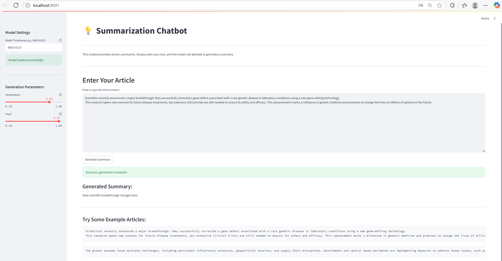

# MSAI 495 Assignment: **Text Generation with LoRA-Quantized DistilGPT-2**

This project implements an end-to-end pipeline for abstractive headline generation on the *XSum* dataset.  
Key features include 8-bit quantization with **bitsandbytes**, parameter-efficient fine-tuning via **LoRA**, data-parallel preprocessing, and an interactive **Streamlit** chatbot UI for real-time summarization.

---

## Project Structure
```text
├── configs/ # YAML configs
├── models/ # Timestamped checkpoints written by run.py
├── run.py # CLI trainer / inference script
├── ui.py # Streamlit chatbot front-end
├── requirements.txt # Python dependencies
└── README.md
```


---

## Dataset

| Name | Link | Size | Task |
|------|------|------|------|
| **XSum** (EdinburghNLP/xsum) | Hugging Face 🤗 | ~226 K articles | Single-sentence abstractive summaries |

The training script filters reference summaries to ≤ 25 tokens, aligns articles + summaries into a *TL;DR* prompt format, and tokenizes each example to a maximum context length of 1024.

---

## Getting Started

### 1. Installation

```bash
conda env create -f environment.yml
conda activate lora
```

### 2. Train

```bash
accelerate launch run.py --config ./configs/train_config.yaml
```
A timestamped folder such as models/lora-xsum-0602-0215/ will be created, containing both adapters and the tokenizer.

### 3. Test

Generate three random examples from the XSum test split:
```bash
python run.py --config ./configs/generate_random_config.yaml
```
Generate a headline for your own text:
```bash
python run.py --config ./configs/generate_input_config.yaml
```
### 4. Launch the Chatbot UI

```bash
streamlit run ui.py
```
Use the left sidebar to set the timestamp of the model you wish to load, adjust temperature / top-p, and start summarizing.

---

## Model Architecture

| Component        | Details                                                                      |
| ---------------- | ---------------------------------------------------------------------------- |
| **Backbone**     | DistilGPT-2 (82 M parameters)                                                |
| **Quantization** | 8-bit weight quantization via *bitsandbytes*                                 |
| **Fine-tuning**  | LoRA (rank 32, α 32, dropout 0.05) on all self-attention *q,k,v* proj layers |
| **Optimizer**    | AdamW, lr 2 × 10-4, warm-up 200 steps                                        |
| **Trainer**      | 🤗 *Trainer* wrapped in **Accelerate** (enables multi-GPU)                   |

---

## Model Architecture

### 1. Distributed Preprocessing & Training Pipelines

- datasets.map(..., num_proc=N) utilises N CPU processes for tokenisation.

- Training is wrapped by Accelerate, so running with multiple GPUs is as simple as:

```bash
accelerate launch run.py --config ./configs/train_config.yaml
```

### 2. Chatbot GUI

- ui.py delivers a full-featured Streamlit web app:

    - One-click model loading (with caching)
    - Sliders for temperature and top-p
    - Live status / error messages
    - Example articles for quick testing

---

## Results Overview

Below is a screenshot of the Streamlit interface generating a headline.



Qualitatively, the LoRA-quantized model produces concise, fluent headlines